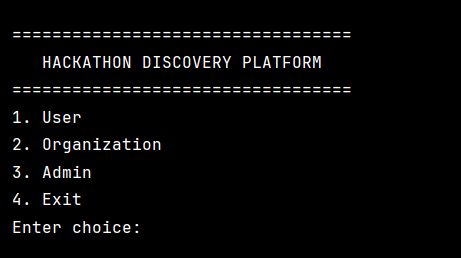
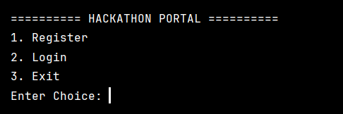
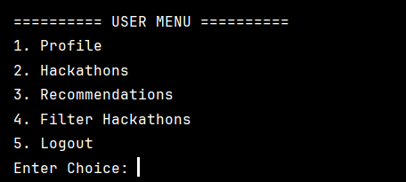
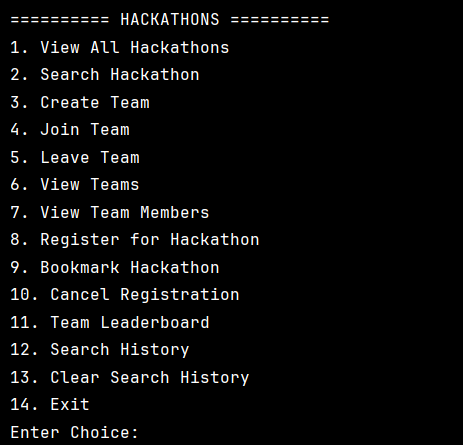
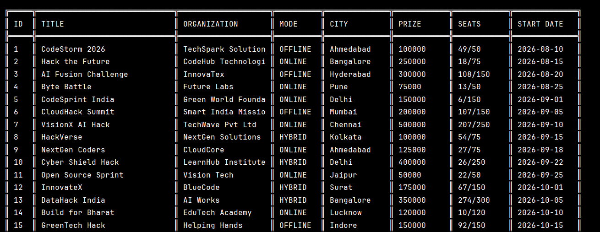
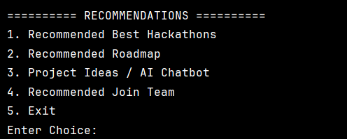
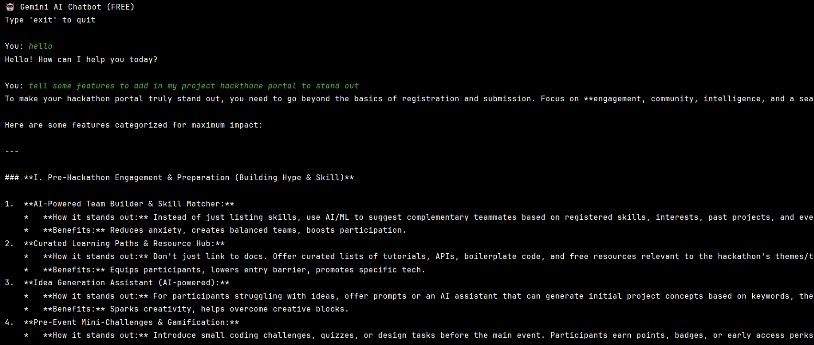
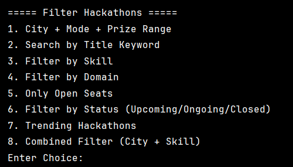
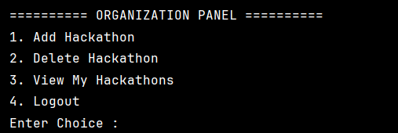

# 🚀 Hackathon Discovery Platform

A **Java + MySQL based Hackathon Discovery Platform** that brings hackathon discovery, registration, team management, personalized recommendations, AI assistance, organization management, and administration into one system.

The project is designed for students/developers who want to **find hackathons, prepare for them, build teams, register, and get personalized guidance** from a single platform.

---

## 📌 Project Overview

Hackathons are announced across different platforms and communities. Students may miss opportunities because information is scattered and because it can be difficult to know:

- Which hackathon matches their skills
- Which skills they need to improve
- Which team they should join
- What project idea they can build
- Which hackathons are suitable for them

This project solves these problems by providing a centralized **Hackathon Discovery and Management Platform**.

---

## 🎯 Main Objectives

- Provide a single platform for discovering hackathons
- Allow users to create and manage profiles
- Allow organizations to publish and manage hackathons
- Provide hackathon search and filtering
- Allow users to register for hackathons
- Support team creation and team joining
- Provide skill-based hackathon recommendations
- Provide AI-powered learning roadmaps
- Provide AI-powered project ideas and chatbot assistance
- Recommend teams based on skills
- Send email notifications to users
- Provide an admin panel for system management and statistics
- Maintain organization audit information

---

# 👥 User Roles

The system has three main roles:

```text
=============================
      HACKATHON PLATFORM
=============================

1. User
2. Organization
3. Admin
4. Exit
```

---

# 👤 1. USER MODULE

A user can register/login and access the following modules.

## 🔐 User Authentication

```text
=========== HACKATHON PORTAL ===========

1. Register
2. Login
3. Exit
```

Users register with their basic information and can later log in using their credentials.

---

## 👤 User Menu

```text
=========== USER MENU ===========

1. Profile
2. Hackathons
3. Recommendations
4. Filter Hackathons
5. Logout
```

---

## 🧑 Profile Management

Users can:

- View Profile
- Edit Profile
- Manage skills
- Manage interests

User skills are stored in the database and are used by the recommendation system.

---

# 🏆 Hackathon Module

The user can access:

```text
=========== HACKATHONS ===========

1. View All Hackathons
2. Search Hackathon
3. Create Team
4. Join Team
5. Leave Team
6. View Teams
7. View Team Members
8. Register for Hackathon
9. Bookmark Hackathon
10. Cancel Registration
11. Team Leaderboard
12. Search History
13. Clear Search History
14. Exit
```

### Hackathon Features

Users can:

- View available hackathons
- Search hackathons
- View hackathon details
- Register for hackathons
- Cancel registrations
- Bookmark hackathons
- Create teams
- Join teams
- Leave teams
- View teams
- View team members
- View team leaderboard
- Maintain search history

---

# 🔎 Hackathon Filtering

The platform provides multiple filtering options:

```text
===== Filter Hackathons =====

1. City + Mode + Prize Range
2. Search by Title Keyword
3. Filter by Skill
4. Filter by Domain
5. Only Open Seats
6. Filter by Status
7. Trending Hackathons
8. Combined Filter (City + Skill)
```

This helps users quickly find hackathons relevant to their requirements.

---

# 🤖 Recommendation System

The recommendation module contains:

```text
========== RECOMMENDATIONS ==========

1. Recommended Best Hackathons
2. Recommended Roadmap
3. Project Ideas / AI Chatbot
4. Recommended Join Team
5. Exit
```

---

## 🧠 1. Recommended Best Hackathons — DBMS

The system compares:

```text
User Skills
      ↓
Required Hackathon Skills
      ↓
Skill Matching
      ↓
Match Count
      ↓
Top Recommended Hackathons
```

The user's skills are retrieved from the database and compared with the skills required by hackathons.

The hackathons with the highest skill match are recommended first.

---

## 📚 2. Recommended Roadmap — Gemini AI

The system collects information such as:

- User skills
- Skill proficiency
- User interests
- Registered hackathons
- Required hackathon skills

This information is converted into an AI prompt and sent to the **Gemini API**.

The AI generates:

- Missing skills
- Recommended learning topics
- Learning order
- Useful technologies/tools
- Preparation guidance
- Readiness assessment

---

## 💡 3. Project Ideas / AI Chatbot

The project includes a Gemini-powered chatbot.

Users can ask questions such as:

```text
You: hello

You: tell some features to add in my
project hackathon portal to stand out
```

The chatbot can help with:

- Project ideas
- Hackathon preparation
- Feature suggestions
- Technology suggestions
- Problem-solving guidance
- General hackathon-related questions

---

## 🤝 4. Recommended Join Team — DBMS

The team recommendation system compares:

```text
User Skills
      ↓
Team Members' Skills
      ↓
Hackathon Required Skills
      ↓
Missing / Covered Skills
      ↓
Recommended Teams
```

This helps users find teams where their skills can contribute.

---

# 🏢 2. ORGANIZATION MODULE

Organizations can register and manage their hackathons.

## Organization Menu

```text
========== ORGANIZATION PANEL ==========

1. Add Hackathon
2. Delete Hackathon
3. View My Hackathons
4. Logout
```

---

## 📝 Organization Registration

Organizations provide information such as:

- Organization name
- Email
- Password
- Contact person
- Phone
- Website
- Organization type
- City

Supported organization types include:

- Company
- College
- University
- Startup
- Community
- NGO
- Other

---

## ➕ Add Hackathon

An organization can create a hackathon by entering:

- Title
- Location city
- Mode
- Prize pool
- Start date
- End date
- Registration deadline
- Maximum participants

The system automatically stores the relationship between:

```text
Organization
      ↓
Hackathon
```

using the `organizationhackthone` table.

---

## ❌ Delete Hackathon

Organizations can delete hackathons that they have created.

The system also maintains organization audit information for hackathon-related actions.

---

## 👀 View My Hackathons

An organization can view only the hackathons associated with its organization ID.

---

# 📧 Email Notification System

The project uses JavaMail with Gmail SMTP to send email notifications.

Example use cases:

- Hackathon registration confirmation
- Hackathon-related notifications
- Joining/team-related notifications
- New hackathon notifications

Basic flow:

```text
User registers
      ↓
Registration stored in MySQL
      ↓
Email notification
      ↓
User receives confirmation
```

> ⚠️ For security, Gmail App Passwords should not be stored directly in source code. Use environment variables or a secure configuration file when publishing the project.

---

# 🛡️ 3. ADMIN MODULE

The admin controls and monitors the platform.

The admin login uses a predefined/common administrator ID and password.

After successful authentication, the admin can access management modules such as:

- Users
- Organizations
- Hackathons
- Registrations
- Teams
- Statistics

---

## 👨‍💼 Admin Modules

### Admin User

- View users
- Search users
- View user profile
- Delete users

### Admin Organization

- View organizations
- Search organizations
- Delete organizations
- View organization hackathons

### Admin Hackathon

- View hackathons
- Delete hackathons
- View hackathon details

### Admin Registration

- View registrations
- View cancelled registrations
- View waitlisted registrations
- Registration statistics

### Admin Team

- View teams
- Delete teams
- View team members

### Admin Statistics

- Total users
- Total organizations
- Total hackathons
- Total teams
- Most popular hackathon
- Other platform statistics

---

# 🗄️ DATABASE DESIGN

The project uses **MySQL** with the database:

```text
hackthone
```

Main tables include:

```text
users
organization
hackathons
organizationhackthone
skills
userskills
userinterests
domaininterests
hackathondomain
hackathonskillrequired
registration
teams
teammembers
watchlist
recommendationlog
```

---

## 👤 Users

Stores user information.

```text
users
-----------------------------
user_id
name
email
city
created_at
```

---

## 🏢 Organization

Stores organization information.

```text
organization
-----------------------------
organization_id
organization_name
email
password
contact_person
phone
website
organization_type
city
```

---

## 🏆 Hackathons

Stores hackathon information.

```text
hackathons
-----------------------------
hackathon_id
title
location_city
mode
prize_pool
start_date
end_date
registration_deadline
max_participants
current_participants
```

---

## 🔗 Organization-Hackathon Relationship

```text
organizationhackthone
-----------------------------
organization_id
hackthone_id
```

This table connects organizations with the hackathons they create.

---

## 🧑‍💻 Skills

```text
skills
-----------------------------
skill_id
skill_name
```

User skills are connected through:

```text
userskills
-----------------------------
user_id
skill_id
```

---

## 🏆 Hackathon Required Skills

```text
hackathonskillrequired
-----------------------------
hackathon_id
skill_id
```

This table is used by the recommendation system.

---

## 📝 Registration

```text
registration
-----------------------------
registration_id
user_id
hackathon_id
status
waitlist_position
registered_at
```

Possible registration states can include:

```text
REGISTERED
WAITLISTED
CANCELLED
```

---

## 👥 Teams

```text
teams
-----------------------------
team_id
hackathon_id
team_name
max_capacity
status
created_at
leader_user_id
```

Team members are stored in:

```text
teammembers
-----------------------------
team_id
user_id
joined_at
```

---

## 🔖 Watchlist

The watchlist/bookmark feature stores hackathons saved by users.

```text
watchlist
-----------------------------
watchlist_id
user_id
hackathon_id
added_at
```

---

# 🧩 PROJECT ARCHITECTURE

The project is organized using Java classes according to functionality.

```text
src
│
├── Admin
│   ├── admin.java
│   ├── AdminUser.java
│   ├── AdminOrganization.java
│   ├── AdminHackathon.java
│   ├── AdminRegistration.java
│   ├── AdminStatistics.java
│   └── AdminTeam.java
│
└── pro1
    ├── MainApp.java
    ├── Main.java
    ├── User.java
    ├── organization.java
    ├── Hackathon.java
    ├── Registration.java
    ├── Team.java
    ├── Watchlist.java
    ├── Recommendation.java
    ├── recommendation_for_Best_hackthone.java
    ├── Recommendation_for_Learning.java
    ├── Recommendation_project_idea.java
    ├── Recommendation_To_Join_team.java
    ├── HackathonFilterDAO.java
    ├── Mailer.java
    ├── mail_for_joining.java
    ├── organization_audit_log.java
    └── ai.java
```

---

# 🛠️ Technologies Used

| Technology | Purpose |
|---|---|
| Java | Main programming language |
| OOP | Project structure and modular design |
| JDBC | Java-MySQL connectivity |
| MySQL | Database management |
| SQL | Data storage and querying |
| Gemini API | AI chatbot, learning roadmap and project ideas |
| JavaMail | Email notifications |
| Git | Version control |
| GitHub | Source code management |

---

# 🔄 Overall System Flow

```text
                    ┌───────────────┐
                    │     START     │
                    └───────┬───────┘
                            │
                            ▼
              ┌─────────────────────────┐
              │ Select User /           │
              │ Organization / Admin    │
              └────────────┬────────────┘
                           │
        ┌──────────────────┼──────────────────┐
        ▼                  ▼                  ▼
      USER           ORGANIZATION           ADMIN
        │                  │                  │
        ▼                  ▼                  ▼
   Profile           Add Hackathon       Manage Users
   Hackathons        Delete Hackathon     Manage Organizations
   Teams             View Hackathons      Manage Hackathons
   Registration                           Manage Registrations
   Bookmark                              Manage Teams
   Filters                               Statistics
   Recommendations
        │
        ▼
   DBMS + Gemini AI
        │
        ▼
   Email Notifications
```

---

# ⭐ Key Features

## For Users

- Registration and Login
- Profile management
- Skill management
- Interest management
- Hackathon discovery
- Hackathon search
- Advanced filtering
- Hackathon registration
- Registration cancellation
- Waitlist support
- Bookmark/watchlist
- Team creation
- Team joining
- Team leaving
- Team member viewing
- Team leaderboard
- Search history
- Search history clearing
- Skill-based recommendations
- AI learning roadmap
- AI project ideas
- Gemini AI chatbot
- Team recommendations
- Email notifications

## For Organizations

- Organization registration
- Organization login
- Add hackathon
- Delete hackathon
- View own hackathons
- Organization-hackathon mapping
- Audit logging

## For Admin

- Admin authentication
- User management
- Organization management
- Hackathon management
- Registration management
- Team management
- Platform statistics

---

# 🖥️ Application Screenshots

The following screenshots show the actual console interface of the project.

> Put your screenshots inside a folder named `screenshots` in the GitHub repository and use the same filenames referenced below.

---

## Main Menu



The main menu allows the user to select:

```text
1. User
2. Organization
3. Admin
4. Exit
```

---

## User Login



Users can register or log in using their credentials.

---

## User Menu



The user menu provides access to profile, hackathons, recommendations and filtering.

---

## Hackathon Menu



Users can search, register, bookmark, cancel registration and manage teams.

---

## Hackathon Listing



Hackathons are displayed with information such as:

- ID
- Title
- Organization
- Mode
- City
- Prize
- Seats
- Start date

---

## Recommendation Menu


Users can select between DBMS-based and AI-based recommendations.

---

## AI Learning Recommendation



The AI analyzes the user's skills and identifies missing skills and recommended learning paths.

---

## Gemini AI Chatbot



The chatbot can answer questions and suggest new features and ideas for the hackathon project.

---

## Hackathon Filters



Users can filter hackathons using city, mode, prize range, skill, domain, seats and status.

---

## Organization Panel



Organizations can:

```text
1. Add Hackathon
2. Delete Hackathon
3. View My Hackathons
4. Logout
```

---

# 🔐 Security Considerations

The current academic project uses JDBC and a MySQL database.

For a production version, the following improvements are recommended:

- Hash passwords using BCrypt/Argon2
- Store API keys in environment variables
- Store Gmail App Passwords securely
- Use connection pooling
- Add stronger input validation
- Use role-based authorization
- Add transaction handling for multi-table operations
- Avoid storing sensitive credentials in source code

---

# 🚀 Future Enhancements

Possible future improvements include:

- Web-based GUI
- Spring Boot backend
- React/Angular frontend
- Mobile application
- Automated hackathon data collection
- Push notifications
- OAuth login
- Advanced AI team formation
- AI-based hackathon success prediction
- Real-time team chat
- Calendar integration
- Hackathon reminders
- Organizer analytics dashboard
- Leaderboards and badges
- Cloud deployment

---

# 📊 Core Recommendation Logic

### Best Hackathon

```text
User Skills
     +
Hackathon Required Skills
     ↓
Calculate Skill Matches
     ↓
Sort by Match Count
     ↓
Top Hackathons
```

### Learning Roadmap

```text
User Skills
User Interests
Registered Hackathons
Required Skills
        ↓
     Gemini AI
        ↓
Missing Skills
Learning Order
Useful Technologies
Readiness Assessment
```

### Team Recommendation

```text
User Skills
     +
Team Member Skills
     +
Hackathon Required Skills
        ↓
Skill Gap Analysis
        ↓
Recommended Teams
```

---

# 📁 Project Highlights

This project demonstrates practical implementation of:

- Java OOP
- Classes and objects
- Encapsulation
- Modular programming
- JDBC
- PreparedStatement
- ResultSet
- SQL joins
- Relational database design
- Many-to-many relationships
- CRUD operations
- Authentication
- Team management
- Recommendation algorithms
- AI API integration
- Email integration
- Audit logging
- Search and filtering
- Admin management

---

# ▶️ How to Run

## 1. Clone the Repository

```bash
git clone <your-github-repository-url>
```

## 2. Create MySQL Database

Create:

```sql
CREATE DATABASE hackthone;
```

Import the project's SQL file into the database.

## 3. Configure Database

The current JDBC configuration uses:

```text
Host: localhost
Port: 3306
Database: hackthone
Username: root
Password: ""
```

Change these values if your MySQL configuration is different.

## 4. Add Required Libraries

Make sure the project contains:

- MySQL Connector/J
- Jakarta Mail
- Gemini API dependencies/configuration

## 5. Configure Gemini API

Store the Gemini API key securely as an environment variable rather than directly in source code.

## 6. Run the Application

Run the main application class.

```text
MainApp.java
```

or the project's configured main class.

---

# 🧪 Example User Journey

```text
User
 ↓
Register
 ↓
Login
 ↓
Complete Profile
 ↓
Add Skills & Interests
 ↓
View Hackathons
 ↓
Filter/Search
 ↓
Get Recommendations
 ↓
Register for Hackathon
 ↓
Create / Join Team
 ↓
Get AI Learning Roadmap
 ↓
Get Project Ideas
 ↓
Receive Email Notifications
```

---

# 🏢 Example Organization Journey

```text
Organization
 ↓
Register
 ↓
Login
 ↓
Add Hackathon
 ↓
Hackathon Stored in Database
 ↓
Organization-Hackathon Mapping
 ↓
Users Discover Hackathon
 ↓
Users Register
 ↓
Organization Views Its Hackathons
 ↓
Delete Hackathon if Required
```

---

# 👨‍💻 Author

**Het Jiyani**

B.Tech Computer Engineering Student

---

# 📜 License

This project is developed as an academic/educational project.

You are free to study and modify the project for learning purposes.

---

# ⭐ Project Summary

**Hackathon Discovery Platform** is a console-based Java application that combines:

```text
        ┌───────────────────────────┐
        │ HACKATHON DISCOVERY       │
        ├───────────────────────────┤
        │ User Management           │
        │ Organization Management   │
        │ Admin Management          │
        │ Hackathon Management      │
        │ Search & Filtering        │
        │ Team Management           │
        │ Registration              │
        │ Watchlist                 │
        │ DBMS Recommendations      │
        │ Gemini AI                 │
        │ Email Notifications       │
        │ Audit Logging             │
        └───────────────────────────┘
```

The goal is to make hackathon discovery and participation **simpler, more personalized, and more intelligent**.
